# 2. High Level Architecture

## 2.1 Technical Summary

SmartScheduler is a **modular monolith fullstack application** built on .NET 8 backend with React 18+ frontend, deployed as a unified system on AWS infrastructure. The architecture follows **Clean Architecture principles with Domain-Driven Design (DDD)** and **Command Query Responsibility Segregation (CQRS)** to ensure maintainability and scalability.

**Backend:** The .NET 8 API implements a layered architecture (Domain → Application → Infrastructure → API) with event-driven coordination across three distinct user roles (Dispatcher, Customer, Contractor). A sophisticated **weighted scoring algorithm** ranks contractors based on availability, proximity, and quality ratings, returning recommendations in <500ms even with 10,000+ contractors.

**Frontend:** React 18+ with TypeScript provides three purpose-built user interfaces sharing a common component library. State management uses React Context API + useReducer (no Redux overhead). Real-time updates via SignalR ensure all three portals reflect changes within 100ms.

**Integration:** SignalR WebSocket connections provide real-time bidirectional communication. Domain events published to an in-memory event bus trigger cross-system coordination (job assignment → contractor notification → customer update). AWS SES handles transactional email notifications for critical events.

**Infrastructure:** AWS-native deployment with App Runner (backend container), RDS PostgreSQL (data persistence), S3 + CloudFront (frontend static assets), and Secrets Manager (configuration). The architecture supports horizontal scaling while maintaining transactional consistency through PostgreSQL ACID guarantees.

This architecture delivers on PRD goals: intelligent matching, real-time coordination, role-based access control, and production-grade quality for portfolio demonstration.

---

## 2.2 Platform and Infrastructure Choice

**Platform:** **AWS (Amazon Web Services)**

**Key Services:**

- **App Runner:** Backend container hosting (auto-scaling, zero infrastructure management)
- **RDS PostgreSQL:** Managed relational database with automated backups
- **S3 + CloudFront:** Frontend static asset hosting with global CDN
- **ECR:** Docker image registry for backend containers
- **SES:** Transactional email service (job notifications, contractor alerts, customer updates)
- **Secrets Manager:** Secure credential storage (database passwords, API keys, JWT secrets)
- **CloudWatch:** Logging, monitoring, and alerting

**Deployment Host and Regions:**

- **Primary Region:** `us-east-1` (Virginia) - lowest latency for US-based users, broadest AWS service availability
- **Staging Environment:** Same region, isolated resources
- **Production:** Single-region deployment for MVP; multi-region failover deferred to Phase 2

**Rationale:**

- **AWS Mandate:** Non-negotiable per PRD; demonstrates cloud-native architecture
- **App Runner vs. ECS/EKS:** App Runner provides container orchestration without Kubernetes complexity—perfect for modular monolith, faster to production
- **PostgreSQL over DynamoDB:** Relational data model (Jobs → Contractors → Reviews) benefits from ACID transactions; complex queries (ranking algorithm) require SQL capabilities
- **SES over SendGrid:** AWS-native integration, lower cost at scale, no third-party dependency
- **Single Region for MVP:** Reduces complexity; CloudFront CDN handles global frontend performance; multi-region adds ~3 weeks of effort with marginal MVP benefit

---

## 2.3 Repository Structure

**Structure:** **Monorepo**

**Monorepo Tool:** **Native npm workspaces** (no Nx/Turborepo overhead for 2-package setup)

**Package Organization:**

```
smartscheduler/
├── backend/          # .NET 8 API (modular monolith)
├── frontend/         # React 18+ TypeScript (three portals)
└── shared/           # Shared TypeScript types (API contracts, DTOs)
```

**Rationale:**

- **Monorepo Benefits:** Single CI/CD pipeline, atomic commits across frontend/backend, easier code review, simpler dependency management
- **npm Workspaces Sufficiency:** Only 2-3 packages; Nx/Turborepo adds complexity without ROI for this scale
- **Shared Types Package:** API contracts defined once, consumed by both backend (.NET C# generation) and frontend (TypeScript), eliminating type drift
- **Portfolio Value:** Demonstrates understanding of modern full-stack workflows and type safety end-to-end

---

## 2.4 High Level Architecture Diagram

```mermaid
graph TB
    subgraph "User Access"
        Dispatcher[👤 Dispatcher<br/>Desktop/Tablet]
        Customer[👤 Customer<br/>Mobile/Desktop]
        Contractor[👤 Contractor<br/>Mobile]
    end

    subgraph "Frontend Layer - CloudFront CDN"
        WebApp[React SPA<br/>Three Role-Based UIs<br/>S3 + CloudFront]
    end

    subgraph "Backend Layer - AWS App Runner"
        API[.NET 8 API<br/>Clean Architecture]
        SignalR[SignalR Hub<br/>Real-Time Events]
        Scoring[Scoring Engine<br/>Weighted Algorithm]
    end

    subgraph "Data Layer"
        DB[(PostgreSQL<br/>RDS)]
        Cache[Redis Cache<br/>ElastiCache]
    end

    subgraph "External Services"
        Maps[Google Maps API<br/>Distance/Travel Time]
        Email[AWS SES<br/>Transactional Email]
    end

    Dispatcher --> WebApp
    Customer --> WebApp
    Contractor --> WebApp

    WebApp --> API
    WebApp <--> SignalR

    API --> DB
    API --> Cache
    API --> Scoring
    API --> Maps
    API --> Email

    SignalR --> DB
    Scoring --> DB
    Scoring --> Maps
```



---

## 2.5 Architectural Patterns

**Overall Architecture Patterns:**

- **Modular Monolith:** Single deployable backend organized by features (Contractors, Jobs, Scoring, Notifications), not microservices. Enables rapid development with clear module boundaries for future extraction if needed. _Rationale:_ MVP velocity without microservice complexity; portfolio demonstrates bounded contexts without over-engineering.

- **Clean Architecture (Onion Architecture):** Layered design with Domain at center, surrounded by Application, Infrastructure, and API layers. Dependencies point inward only. _Rationale:_ Testability, maintainability, and demonstrates SOLID principles—critical for portfolio quality.

- **Event-Driven Architecture:** Domain events (JobAssigned, ContractorAccepted, RatingPosted) published to in-memory event bus, consumed by handlers for side effects (email notifications, cache invalidation). _Rationale:_ Loose coupling enables future extensibility; real-time coordination requires event propagation.

**Frontend Patterns:**

- **Component-Based UI with TypeScript:** React functional components with strict TypeScript typing. _Rationale:_ Type safety prevents runtime errors; modern React patterns (hooks, functional components) demonstrate current best practices.

- **Role-Based UI Composition:** Three distinct portal experiences (Dispatcher Dashboard, Customer Portal, Contractor Portal) built from shared component library but optimized for role-specific workflows. _Rationale:_ PRD explicitly requires purpose-built UIs; shared components ensure consistency while enabling specialization.

- **Context + Reducer State Management:** React Context API for global state (AuthContext, NotificationContext), useReducer for complex state machines (job assignment workflow). _Rationale:_ Sufficient for app complexity; Redux adds unnecessary boilerplate; demonstrates understanding of when to use simpler patterns.

**Backend Patterns:**

- **Domain-Driven Design (DDD):** Rich domain models (Contractor, Job, Assignment, Review) with business logic encapsulated in entities and value objects. Aggregates enforce consistency boundaries. _Rationale:_ Business logic complexity (scoring algorithm, availability engine) requires domain-centric design; portfolio showcases enterprise patterns.

- **CQRS (Command Query Responsibility Segregation):** Write operations (commands like AssignJobCommand) separated from read operations (queries like GetContractorRecommendationsQuery). _Rationale:_ Commands enforce business rules; queries optimized for UI needs; demonstrates understanding of read/write workload separation.

- **Repository Pattern:** Data access abstracted behind `IContractorRepository`, `IJobRepository` interfaces. Entity Framework Core implements repositories. _Rationale:_ Testability (mock repositories in unit tests), future database portability, demonstrates dependency inversion principle.

**Integration Patterns:**

- **Backend for Frontend (BFF) Lite:** Single API with role-specific endpoints (`/api/dispatcher/*`, `/api/customer/*`, `/api/contractor/*`) returning tailored DTOs per role. _Rationale:_ Security (role-based data filtering), performance (only necessary data returned), clear API contracts per user type.

- **Real-Time Push via SignalR:** WebSocket-based bidirectional communication for live updates (job status changes, contractor notifications). _Rationale:_ PRD requires <100ms latency; polling insufficient for real-time coordination.

- **API Gateway Pattern (Implicit):** CloudFront + App Runner provide single entry point with HTTPS termination, DDoS protection, and request routing. _Rationale:_ AWS-native capabilities eliminate need for separate API Gateway service.

---
