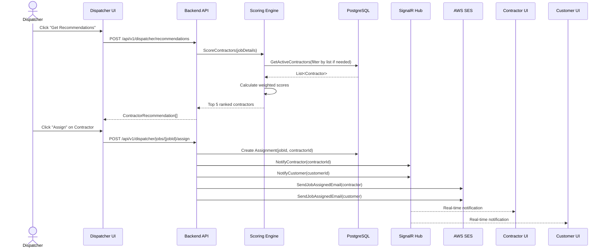

# 8. Core Workflows

## 8.1 Job Assignment Workflow

## 8.2 Contractor Accept/Decline Workflow

_See Section 8 in full document for complete sequence diagrams._

## 8.3 Job Completion & Review Workflow

_See Section 8 in full document for complete sequence diagrams._

---
