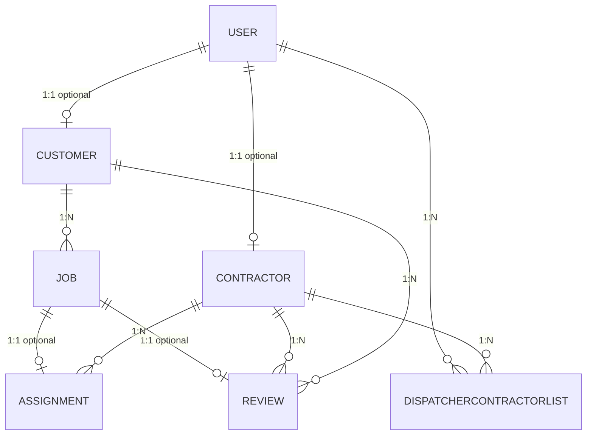

# Database Schema & Entity Relationships

## Overview

This document describes the SmartScheduler database schema, including all entities, relationships, constraints, and indexes.

**Database Engine:** PostgreSQL 16.6  
**ORM:** Entity Framework Core 9.0 with Npgsql provider  
**Location:** SmartScheduler.Infrastructure/Persistence/ApplicationDbContext.cs

---

## Entity Relationship Diagram



---

## Core Entities

### 1. User

**Table:** `Users`

Central authentication entity for all user types in the system.

| Column       | Type         | Constraints             | Notes                                                    |
| ------------ | ------------ | ----------------------- | -------------------------------------------------------- |
| Id           | int          | PK, Identity            | Auto-generated                                           |
| Email        | varchar(256) | NOT NULL, UNIQUE        | Email address (unique index)                             |
| PasswordHash | varchar(512) | NOT NULL                | BCrypt hashed password                                   |
| Role         | int          | NOT NULL                | UserRole enum: Dispatcher(0), Customer(1), Contractor(2) |
| IsActive     | bool         | NOT NULL, DEFAULT true  | Soft delete indicator                                    |
| LastLoginAt  | timestamp    | NULLABLE                | Last login timestamp                                     |
| CreatedAt    | timestamp    | NOT NULL                | Account creation time                                    |
| UpdatedAt    | timestamp    | NULLABLE                | Last update time                                         |
| IsDeleted    | bool         | NOT NULL, DEFAULT false | Soft delete flag                                         |

**Indexes:**

- `IX_Users_Email` (UNIQUE) - Fast email lookups for authentication
- `IX_Users_Role` - Fast role-based filtering
- `IX_Users_IsDeleted` - Fast soft-delete filtering

**Relationships:**

- 1:1 → Contractor (optional, cascade delete)
- 1:1 → Customer (optional, cascade delete)
- 1:N → DispatcherContractorList (optional, cascade delete)

---

### 2. Contractor

**Table:** `Contractors`

Service professional profile. Linked to User with Role = Contractor.

| Column             | Type          | Constraints             | Notes                                                                      |
| ------------------ | ------------- | ----------------------- | -------------------------------------------------------------------------- |
| Id                 | int           | PK, Identity            | Auto-generated                                                             |
| UserId             | int           | FK NOT NULL             | Foreign key to User (cascade delete)                                       |
| Name               | varchar(256)  | NOT NULL                | Contractor's full name                                                     |
| PhoneNumber        | varchar(20)   | NOT NULL                | Contact phone                                                              |
| Location           | varchar(512)  | NOT NULL                | Address                                                                    |
| Latitude           | numeric(10,8) | NOT NULL                | GPS latitude                                                               |
| Longitude          | numeric(11,8) | NOT NULL                | GPS longitude                                                              |
| TradeType          | int           | NOT NULL                | TradeType enum: Flooring(0), HVAC(1), Plumbing(2), Electrical(3), Other(4) |
| WorkingHoursStart  | time          | NOT NULL                | Daily start time                                                           |
| WorkingHoursEnd    | time          | NOT NULL                | Daily end time                                                             |
| AverageRating      | numeric(3,2)  | NULLABLE                | 1-5 scale, calculated from reviews                                         |
| ReviewCount        | int           | NOT NULL, DEFAULT 0     | Number of reviews received                                                 |
| TotalJobsCompleted | int           | NOT NULL, DEFAULT 0     | Career total                                                               |
| IsActive           | bool          | NOT NULL, DEFAULT true  | Active/inactive status                                                     |
| CreatedAt          | timestamp     | NOT NULL                | Profile creation time                                                      |
| UpdatedAt          | timestamp     | NULLABLE                | Last profile update                                                        |
| IsDeleted          | bool          | NOT NULL, DEFAULT false | Soft delete flag                                                           |

**Indexes:**

- `IX_Contractors_IsActive_TradeType` (composite) - Fast availability + trade type filtering for recommendations

**Relationships:**

- N:1 → User (cascade delete on user deletion)
- 1:N → Assignment (cascade delete)
- 1:N → Review (cascade delete)
- 1:N → DispatcherContractorList (cascade delete)

---

### 3. Customer

**Table:** `Customers`

Job requester profile. Linked to User with Role = Customer.

| Column      | Type         | Constraints             | Notes                                        |
| ----------- | ------------ | ----------------------- | -------------------------------------------- |
| Id          | int          | PK, Identity            | Auto-generated                               |
| UserId      | int          | FK NOT NULL             | Foreign key to User (cascade delete, unique) |
| Name        | varchar(256) | NOT NULL                | Customer's full name                         |
| PhoneNumber | varchar(20)  | NOT NULL                | Contact phone                                |
| Location    | varchar(512) | NOT NULL                | Default address for jobs                     |
| CreatedAt   | timestamp    | NOT NULL                | Account creation time                        |
| UpdatedAt   | timestamp    | NULLABLE                | Last profile update                          |
| IsDeleted   | bool         | NOT NULL, DEFAULT false | Soft delete flag                             |

**Relationships:**

- N:1 → User (cascade delete)
- 1:N → Job (cascade delete)
- 1:N → Review (no action on delete)

---

### 4. Job

**Table:** `Jobs`

Core workflow entity - work requests created by customers.

| Column                 | Type          | Constraints             | Notes                                                                              |
| ---------------------- | ------------- | ----------------------- | ---------------------------------------------------------------------------------- |
| Id                     | int           | PK, Identity            | Auto-generated                                                                     |
| CustomerId             | int           | FK NOT NULL             | Foreign key to Customer (cascade delete)                                           |
| JobType                | int           | NOT NULL                | TradeType enum                                                                     |
| Location               | varchar(512)  | NOT NULL                | Job location address                                                               |
| Latitude               | numeric(10,8) | NOT NULL                | GPS latitude                                                                       |
| Longitude              | numeric(11,8) | NOT NULL                | GPS longitude                                                                      |
| DesiredDateTime        | timestamp     | NOT NULL                | When customer wants work done                                                      |
| EstimatedDurationHours | numeric(5,2)  | NOT NULL                | Expected duration                                                                  |
| Description            | varchar(2048) | NOT NULL                | Job details                                                                        |
| Status                 | int           | NOT NULL, DEFAULT 0     | JobStatus enum: Pending(0), Assigned(1), InProgress(2), Completed(3), Cancelled(4) |
| AssignedContractorId   | int           | NULLABLE                | Contractor currently assigned                                                      |
| CreatedAt              | timestamp     | NOT NULL                | Job creation time                                                                  |
| UpdatedAt              | timestamp     | NOT NULL                | Last status update                                                                 |
| IsDeleted              | bool          | NOT NULL, DEFAULT false | Soft delete flag                                                                   |

**Indexes:**

- `IX_Jobs_Status_DesiredDateTime` (composite) - Fast job list queries (filter by status + date)

**Relationships:**

- N:1 → Customer (cascade delete)
- 1:1 → Assignment (optional, cascade delete)
- 1:1 → Review (optional, cascade delete, unique constraint)

---

### 5. Assignment

**Table:** `Assignments`

Links jobs to contractors with assignment lifecycle tracking.

| Column       | Type      | Constraints             | Notes                                                                                    |
| ------------ | --------- | ----------------------- | ---------------------------------------------------------------------------------------- |
| Id           | int       | PK, Identity            | Auto-generated                                                                           |
| JobId        | int       | FK NOT NULL, UNIQUE     | Foreign key to Job (cascade delete, one assignment per job)                              |
| ContractorId | int       | FK NOT NULL             | Foreign key to Contractor (cascade delete)                                               |
| AssignedAt   | timestamp | NOT NULL                | When assignment was made                                                                 |
| AcceptedAt   | timestamp | NULLABLE                | When contractor accepted                                                                 |
| DeclinedAt   | timestamp | NULLABLE                | When contractor declined                                                                 |
| StartedAt    | timestamp | NULLABLE                | When work started                                                                        |
| CompletedAt  | timestamp | NULLABLE                | When work completed                                                                      |
| Status       | int       | NOT NULL, DEFAULT 0     | AssignmentStatus enum: Pending(0), Accepted(1), Declined(2), InProgress(3), Completed(4) |
| CreatedAt    | timestamp | NOT NULL                | Assignment creation time                                                                 |
| UpdatedAt    | timestamp | NULLABLE                | Last status update                                                                       |
| IsDeleted    | bool      | NOT NULL, DEFAULT false | Soft delete flag                                                                         |

**Indexes:**

- `IX_Assignments_ContractorId_Status` (composite) - Fast contractor availability checks

**Relationships:**

- N:1 → Job (cascade delete, one per job)
- N:1 → Contractor (cascade delete)

---

### 6. Review

**Table:** `Reviews`

Customer feedback on completed jobs. **One review per job** (unique constraint).

| Column       | Type          | Constraints             | Notes                                       |
| ------------ | ------------- | ----------------------- | ------------------------------------------- |
| Id           | int           | PK, Identity            | Auto-generated                              |
| JobId        | int           | FK NOT NULL, UNIQUE     | Foreign key to Job (cascade delete, unique) |
| ContractorId | int           | FK NOT NULL             | Foreign key to Contractor (no action)       |
| CustomerId   | int           | FK NOT NULL             | Foreign key to Customer (no action)         |
| Rating       | int           | NOT NULL                | Rating scale 1-5                            |
| Comment      | varchar(2048) | NULLABLE                | Optional review text                        |
| CreatedAt    | timestamp     | NOT NULL                | Review creation time                        |
| UpdatedAt    | timestamp     | NULLABLE                | Last edit time                              |
| IsDeleted    | bool          | NOT NULL, DEFAULT false | Soft delete flag                            |

**Indexes:**

- `IX_Reviews_JobId_Unique` (UNIQUE) - Enforces one review per job

**Relationships:**

- N:1 → Job (cascade delete)
- N:1 → Contractor (no action)
- N:1 → Customer (no action)

---

### 7. DispatcherContractorList

**Table:** `DispatcherContractorLists`

Dispatcher's curated list of favorite contractors for quick access.

| Column       | Type      | Constraints             | Notes                                                      |
| ------------ | --------- | ----------------------- | ---------------------------------------------------------- |
| Id           | int       | PK, Identity            | Auto-generated                                             |
| DispatcherId | int       | FK NOT NULL             | Foreign key to User where Role=Dispatcher (cascade delete) |
| ContractorId | int       | FK NOT NULL             | Foreign key to Contractor (cascade delete)                 |
| AddedAt      | timestamp | NOT NULL                | When contractor was favorited                              |
| CreatedAt    | timestamp | NOT NULL                | Record creation time                                       |
| UpdatedAt    | timestamp | NULLABLE                | Last update time                                           |
| IsDeleted    | bool      | NOT NULL, DEFAULT false | Soft delete flag                                           |

**Relationships:**

- N:1 → User/Dispatcher (cascade delete)
- N:1 → Contractor (cascade delete)

---

## Foreign Key Constraints & Cascading Delete

### Cascade Delete Behavior

**When User is deleted:**

- Related Contractor → deleted (if Role = Contractor)
- Related Customer → deleted (if Role = Customer)
- Related DispatcherContractorList entries → deleted

**When Customer is deleted:**

- Related Jobs → deleted
- Related Reviews → deleted (via Job cascade)

**When Job is deleted:**

- Related Assignment → deleted
- Related Review → deleted

**When Contractor is deleted:**

- Related Assignments → deleted
- Related DispatcherContractorList entries → deleted

### No-Action Delete Behavior

**Review table:**

- Contractor deletion does NOT delete reviews (no action) - preserves review history
- Customer deletion does NOT delete reviews (no action) - preserves review history

---

## Enums

### UserRole

```csharp
public enum UserRole
{
    Dispatcher = 0,
    Customer = 1,
    Contractor = 2
}
```

### TradeType

```csharp
public enum TradeType
{
    Flooring = 0,
    HVAC = 1,
    Plumbing = 2,
    Electrical = 3,
    Other = 4
}
```

### JobStatus

```csharp
public enum JobStatus
{
    Pending = 0,
    Assigned = 1,
    InProgress = 2,
    Completed = 3,
    Cancelled = 4
}
```

### AssignmentStatus

```csharp
public enum AssignmentStatus
{
    Pending = 0,
    Accepted = 1,
    Declined = 2,
    InProgress = 3,
    Completed = 4
}
```

---

## Common SQL Queries

### Get User's Jobs (Customer)

```sql
SELECT j.*
FROM Jobs j
JOIN Customers c ON j.CustomerId = c.Id
WHERE c.UserId = @userId
ORDER BY j.DesiredDateTime DESC;
```

### Get Contractor's Completed Jobs & Reviews

```sql
SELECT
    j.Id as JobId,
    j.Description,
    j.CompletedAt,
    r.Rating,
    r.Comment
FROM Jobs j
JOIN Assignments a ON j.Id = a.JobId
LEFT JOIN Reviews r ON j.Id = r.JobId
WHERE a.ContractorId = @contractorId
  AND j.Status = 3  -- Completed
ORDER BY j.UpdatedAt DESC;
```

### Find Available Contractors by Trade Type

```sql
SELECT c.*
FROM Contractors c
WHERE c.TradeType = @tradeType
  AND c.IsActive = true
  AND c.IsDeleted = false
ORDER BY c.AverageRating DESC;
```

### Get Dispatcher's Favorited Contractors

```sql
SELECT c.*
FROM DispatcherContractorLists dcl
JOIN Contractors c ON dcl.ContractorId = c.Id
WHERE dcl.DispatcherId = @dispatcherId
ORDER BY dcl.AddedAt DESC;
```

### Get Pending Jobs Sorted by Date

```sql
SELECT j.*
FROM Jobs j
WHERE j.Status = 0  -- Pending
ORDER BY j.DesiredDateTime ASC;
```

### Contractor Availability Check

```sql
SELECT a.Id, a.JobId, a.Status
FROM Assignments a
WHERE a.ContractorId = @contractorId
  AND a.Status IN (0, 3)  -- Pending or InProgress
ORDER BY a.CreatedAt DESC;
```

---

## Performance Considerations

### Indexed Columns for Queries

- **User Authentication:** `Email` (unique, primary auth lookup)
- **Role-Based Filtering:** `Role` (used in many authorization checks)
- **Contractor Recommendations:** `(IsActive, TradeType)` composite index
- **Job Listing:** `(Status, DesiredDateTime)` composite index
- **Assignment Availability:** `(ContractorId, Status)` composite index

### Queries Without Full Table Scans

All common queries benefit from indexes defined in OnModelCreating():

- Email lookups → `IX_Users_Email` (unique)
- Role filtering → `IX_Users_Role`
- Contractor filtering → `IX_Contractors_IsActive_TradeType`
- Job queries → `IX_Jobs_Status_DesiredDateTime`
- Assignment checks → `IX_Assignments_ContractorId_Status`

---

## Migration & Maintenance

### Initial Migration

```bash
dotnet ef migrations add Initial --project SmartScheduler.Infrastructure --startup-project SmartScheduler.API
dotnet ef database update --project SmartScheduler.Infrastructure --startup-project SmartScheduler.API
```

### Reset Database (Development Only)

```bash
dotnet ef database drop --force --project SmartScheduler.Infrastructure --startup-project SmartScheduler.API
dotnet ef database update --project SmartScheduler.Infrastructure --startup-project SmartScheduler.API
```

### View Migrations

```bash
dotnet ef migrations list --project SmartScheduler.Infrastructure --startup-project SmartScheduler.API
```

### Seed Test Data

The `DatabaseSeeder` class populates the database with sample data:

- 1 Dispatcher user
- 1 Customer user
- 3 Contractor users (with different TradeTypes)
- 5 Sample jobs (various statuses)
- 3 Sample assignments
- 2 Sample reviews
- Dispatcher's favorited contractors

Seeding is automatic on app startup in Development environment (via Program.cs).

---

## Connection String Configuration

### Local Development

**File:** `appsettings.Development.json`

```json
{
  "ConnectionStrings": {
    "DefaultConnection": "Host=localhost;Port=5432;Database=smartscheduler_dev;Username=postgres;Password=postgres"
  }
}
```

### Production

**Source:** AWS Secrets Manager (key: `SmartScheduler/Database/ConnectionString`)

Requires:

- RDS PostgreSQL instance in AWS
- Secrets Manager entry with connection string
- IAM role with Secrets Manager read permissions

---

## Soft Deletes

All entities include `IsDeleted` flag for soft delete support:

- Records are marked deleted, not permanently removed
- Filters in queries should check `IsDeleted = false`
- Enables data recovery and historical analysis
- Maintains referential integrity

---

## Data Validation

### Constraints Enforced at Database Level

- **User.Email** - UNIQUE, NOT NULL
- **Review.JobId** - UNIQUE (one review per job)
- **Foreign Keys** - Enforce referential integrity
- **Not Null** - Required fields cannot be null

### Constraints Enforced at Application Level (Validation Layer)

- Email format validation
- Rating range (1-5)
- Working hours validation
- Estimated duration > 0
- Password complexity

---
